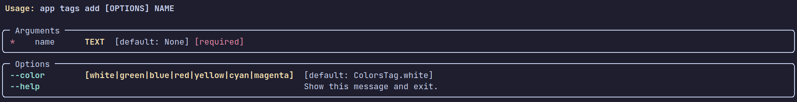

# Todo App CLI

Aplicação para gerenciar tarefas pela linha de comando escrito em python.

<!-- TABLE OF CONTENTS -->
<details open="open">
  <summary><strong>TABLE OF CONTENTS</strong></summary>
  <ul>
    <li><a href="#screenshot">Screenshots</a></li>
    <li>
      <a href="#getting-started">Getting Started</a>
      <ul>
        <li><a href="#requirements">Requirements</a></li>
        <li><a href="#setup">Setup</a></li>
      </ul>
    </li>
    <li><a href="#doc">Doc</a></li>
    <li><a href="#technologies">Technologies</a></li>
  </ul>
</details>

## Screenshots

| Tasks |
|----------------------|
||

| Tags |
|---------|
||

## Getting Started

### Requirements

- [Python](https://www.python.org/)

### Setup

  - Clonando o repositório

    ```sh
  
      $ git clone https://github.com/foschieraanderson/todo-cli.git

    ```

  - Entre na pasta do projeto

    ```sh
      $ cd todo-cli
    ```

  - Inicie um ambiente virtual com sua ferramenta de preferência, eu vou usar **poetry**
    
    ```sh
    # Com o ambiente ativado vamos instalar as dependências

     $ poetry install

    ```

## Doc
  - Verificando comandos disponíveis

    ```sh
      $ python -m todo --help
    ```

  

  - Verificando comandos disponíveis para **tasks**

    ```sh
      $ python -m todo tasks --help
    ```

  

  - Verificando comandos disponíveis para **tags**

    ```sh
      $ python -m todo tags --help
    ```

  

  - Verificando argumentos necessários para adicionar uma **task**

    ```sh
      $ python -m todo tasks add --help
    ```

  

  - Verificando argumentos necessários para adicionar uma **tag**

    ```sh
      $ python -m todo tags add --help
    ```

  

  - Verificando argumentos necessários para completar uma **task**

    ```sh
      $ python -m todo tasks done --help
    ```

  


## Technologies

* [Python](https://www.python.org)
* [Typer](https://typer.tiangolo.com)
* [Rich](https://rich.readthedocs.io)
* [SQLite](https://www.sqlite.org/index.html)
* [Poetry](https://python-poetry.org)


---

<h4 align="center"> <em>&lt;/&gt;</em> <a href="https://github.com/foschieraanderson" target="_blank">foschieraanderson</a> </h4>
